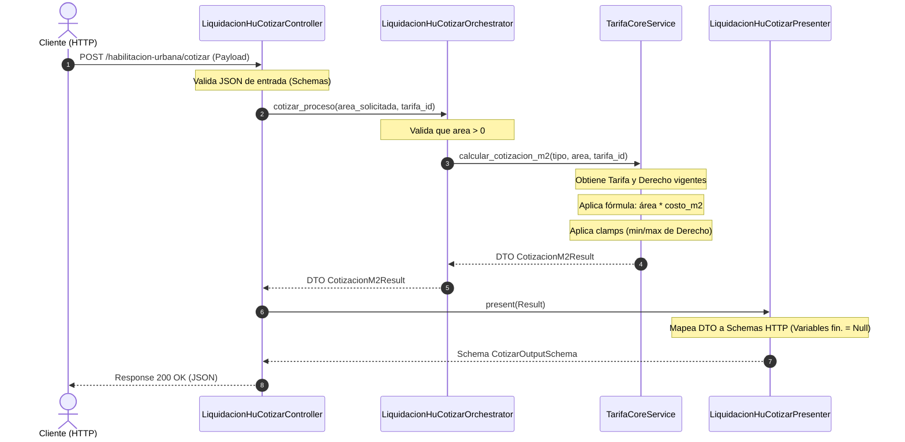
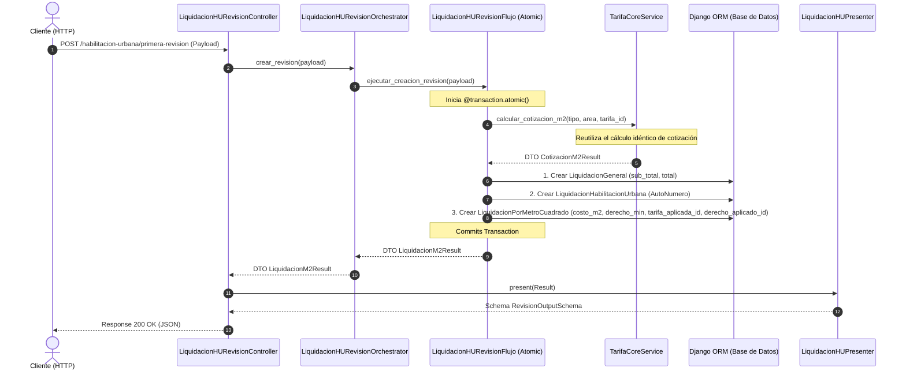

# Diagramas de Flujo y Secuencia: Módulo de Liquidaciones

Los siguientes diagramas detallan el flujo de datos y el comportamiento de las capas (Controller, Orchestrator, Flujo, Core y Presenter) para los procesos de **Cotizar** y **Crear (Primera Revisión)** en especialidades basadas en M2 (Habilitación Urbana y Mecánica de Suelos).

---

## 1. Flujo de Cotización (`POST /cotizar`)

Este diagrama muestra el flujo simplificado donde no hay persistencia en base de datos. Solo se ejecutan validaciones y la fórmula del cálculo M2.

---

## 2. Flujo de Creación de Liquidación (`POST /primera-revision`)

Este diagrama muestra cómo se **reutiliza el mismo Core Service de cálculo** para asegurar que los montos guardados coincidan exactamente con la cotización, garantizando el guardado atómico mediante `@transaction.atomic`.

